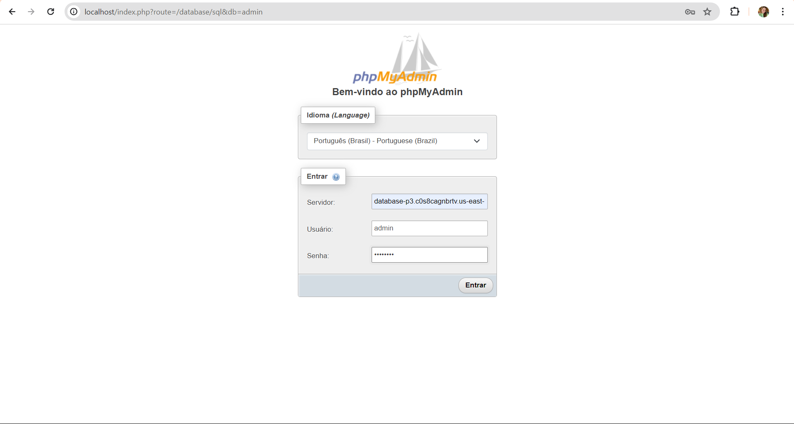
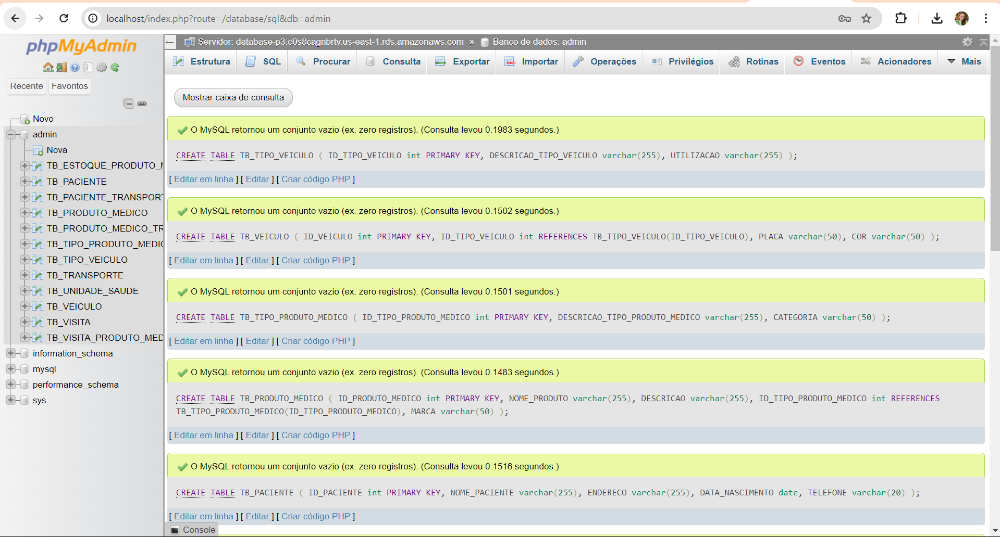
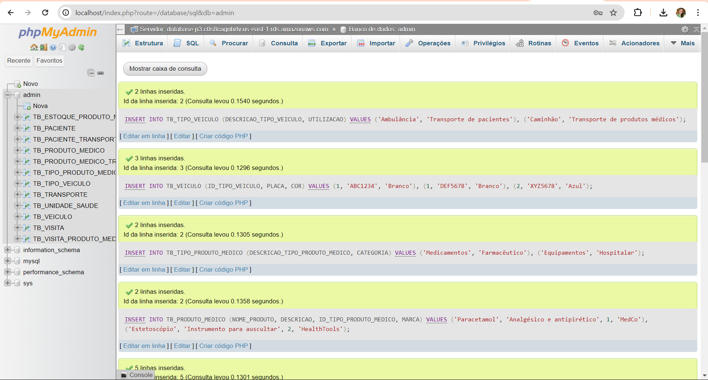
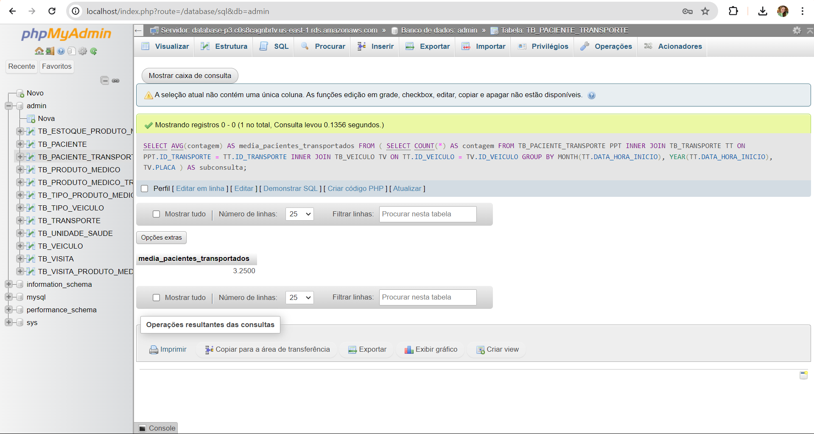

# Modelando dados e fazendo deploy em Nuvem

## Contexto da Modelagem de Dados

Imaginemos um cenário em que você é um consultor de banco de dados encarregado de desenvolver um modelo de entidade e relacionamento (basta o modelo lógico) para uma organização que busca aprimorar a prestação de serviços de transporte relacionados à saúde e à entrega de produtos médicos. Este desafio envolve a interligação crítica entre transporte e serviços/produtos médicos. Existe a necessidade de gerenciar eficazmente o transporte de pacientes para unidades de saúde, como hospitais, clínicas e centros de atendimento médico, enquanto simultaneamente garantindo a entrega eficiente de produtos médicos, como medicamentos, equipamentos médicos e suprimentos hospitalares. O sistema que vai usar este banco de dados deve permitir o acompanhamento de pacientes, garantindo que eles recebam tratamento médico oportuno e, ao mesmo tempo, gerenciar a logística de entrega de suprimentos médicos essenciais para essas instalações de saúde. Podemos ainda pensar nos fatores extras como a otimização de rotas de transporte de pacientes, gestão de frota de veículos médicos, controle de estoque de produtos médicos e a necessidade de avaliar continuamente a eficácia do sistema para melhorar o acesso a serviços de saúde e produtos médicos. Os dados gerados por esse sistema são vitais para a tomada de decisões estratégicas destinadas a aprimorar a prestação de serviços de saúde, garantindo que os pacientes recebam atendimento de qualidade e que os produtos médicos estejam disponíveis quando necessário.

## Modelo Lógico

O modelo lógico criado representa as entidades e relacionamentos necessários para o sistema proposto. Ele apresenta todas as tabelas e seus atributos, bem como as chaves primárias e estrangeiras de cada tabela. As relações entre as entidades são representadas por linhas que incluem as chaves estrangeiras correspondentes e a cardinalidade entre as tabelas.

Para visualizar melhor o modelo lógico, é possível clicar na imagem abaixo para ampliá-la:


- TB_TIPO_VEICULO: Armazena diferentes categorias de veículos utilizados no sistema, como ambulâncias ou caminhões.

- TB_VEICULO: Contém informações sobre os veículos individuais, vinculando cada um a um tipo específico de veículo descrito na tabela TB_TIPO_VEICULO.

- TB_TIPO_PRODUTO_MEDICO: Categoriza os tipos de produtos médicos, como medicamentos ou equipamentos, que são gerenciados pelo sistema.

- TB_PRODUTO_MEDICO: Detalha os produtos médicos individuais, relacionando-os a seus respectivos tipos da tabela TB_TIPO_PRODUTO_MEDICO.

- TB_PACIENTE: Armazena dados dos pacientes atendidos pelo sistema, incluindo informações pessoais.

- TB_UNIDADE_SAUDE: Contém informações sobre as unidades de saúde envolvidas no sistema, como hospitais ou clínicas.

- TB_TRANSPORTE: Registra os detalhes de cada transporte realizado, seja de pacientes ou produtos médicos, incluindo datas e locais de origem e destino.

- TB_PACIENTE_TRANSPORTE: Uma tabela de junção que relaciona pacientes a transportes específicos, mostrando que um paciente foi transportado em um determinado transporte registrado na tabela TB_TRANSPORTE.

- TB_PRODUTO_MEDICO_TRANSPORTE: Relaciona produtos médicos a transportes específicos, relacionando um produto médico a um transporte registrado na tabela TB_TRANSPORTE.

- TB_VISITA: Registra visitas de pacientes às unidades de saúde, especificando a data, o paciente e a unidade de saúde envolvida.

- TB_VISITA_PRODUTO_MEDICO: Associa produtos médicos a visitas específicas de pacientes, registrando quais produtos foram utilizados durante uma visita médica registrada na tabela TB_VISITA.

- TB_ESTOQUE_PRODUTO_MEDICO: Gerencia o estoque de produtos médicos, monitorando as quantidades disponíveis e as datas de entrada e saída dos estoques.

## Criação do Banco de Dados na Nuvem

Para a criação do banco de dados foi utilizado o serviço Amazon RDS (Relational Database Service) e o banco de dados MySQL como proposto pelo enunciado.


Após a criação foram configuradas as regras de segurança para permitir o acesso ao banco de dados a partir de qualquer lugar. Essa configuração foi feita para facilitar a conexão com o banco de dados a partir de qualquer local, sem restrições de IP.

## Conexão com o Banco de Dados

Para a conexão com o banco de dados foi utilizado o PhpMyAdmin, que foi fornecido pelo professor durante a instrução.

Para acessar o banco de dados, foi necessário informar o endpoint do banco de dados, o nome de usuário e a senha definidos durante a criação do banco de dados no Amazon RDS.



## Execução dos Scripts SQL

A partir do modelo lógico foi gerado o script SQL para a criação do banco de dados. Esse script está disponível no arquivo `create.SQL`.

O script de criação do banco de dados foi executado no PhpMyAdmin para criar as tabelas e relacionamentos necessários para o sistema proposto.



Após isso, foram inseridos dados de exemplo nas tabelas para simular o funcionamento do sistema. Esse script está disponível no arquivo `insert.SQL`.



## Consulta Proposta

Para realizar a consulta que retorna o número médio de pacientes transportados por veículo por mês foi utilizada a seguinte query:

```sql
SELECT
    AVG(contagem) AS media_pacientes_transportados
FROM
    (
        SELECT
            COUNT(*) AS contagem
        FROM
            TB_PACIENTE_TRANSPORTE PPT
            INNER JOIN TB_TRANSPORTE TT ON PPT.ID_TRANSPORTE = TT.ID_TRANSPORTE
            INNER JOIN TB_VEICULO TV ON TT.ID_VEICULO = TV.ID_VEICULO
        GROUP BY
            MONTH(TT.DATA_HORA_INICIO),
            YEAR(TT.DATA_HORA_INICIO),
            TV.PLACA
    ) AS subconsulta;
```

Essa query calcula o número de pacientes transportados em cada transporte realizado, agrupando os resultados por veículo, por mês e por ano. Em seguida, calcula a média desses valores para obter o número médio de pacientes transportados por veículo por mês.



A consulta retorna o número médio de pacientes transportados por veículo por mês, considerando todos os transportes registrados no sistema.

Nesse caso o valor retornado é 3,25. Se verificado com os dados de exemplo inseridos no banco de dados, é possível confirmar que o cálculo está correto.